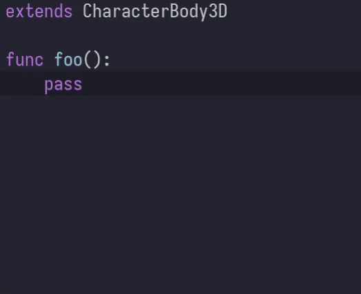

# About
`godot-sidekick-lsp` is a third party additional lsp server that indented to be run along side with existing godot gdscript lsp server to provide missing features like inlay-hints.

# Features
Currently supported features:

- inlay-hints (flickering still WIP)



- extract into function (WIP)

# Installation
There is no precompiled binaries currently so you would need to compile it yourself

``` sh
git clone https://github.com/shadr/godot-sidekick-lsp
cd godot-sidekick-lsp
cargo build --release
```

I use only doom emacs(with lsp-mode package) for development so I don't know how to setup additional lsp servers in other editors, but PRs are welcome.

## Doom Emacs

``` emacs-lisp
(after! lsp-mode
  (lsp-register-client
   (make-lsp-client
    :new-connection (lsp-stdio-connection "/path/to/the/compiled/binary")
    :activation-fn (lsp-activate-on "gdscript")
    :server-id 'godot-sidekick-lsp
    :add-on? t)))
```

